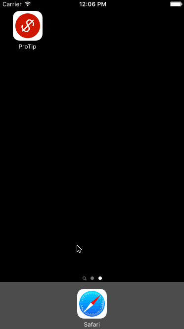

# ProTip

A simple tip calculator for iOS. Calculate tips and split bills with friends.

Time spent: ~10 hours

## Completed User Stories

* [x] Required: User can enter in their bill amount
* [x] Required: User can calculate a tip based on multiple percentage values
* [x] Optional: Currency formatting on input
* [x] Optional: Bill splitting
* [x] Optional: Animations
* [x] Optional: Custom fonts
* [x] Optional: Images
* [x] Optional: App icon

## Notes

- Had some trouble working with number formatters on the text field. Will keep trying to figure this out. (*Edit: it works now!*)

## Walkthrough

